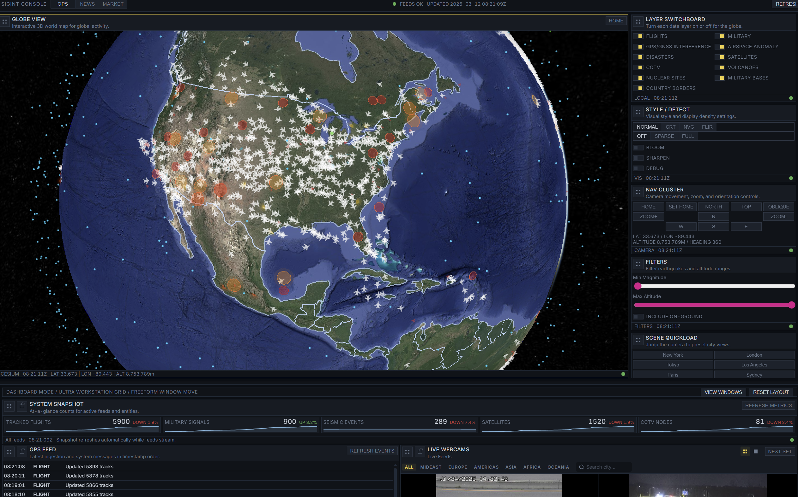
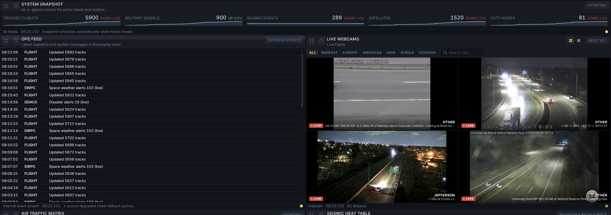
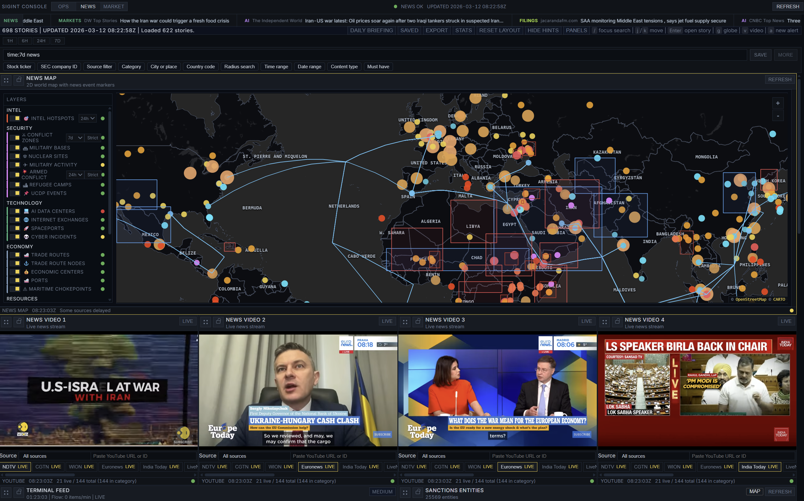
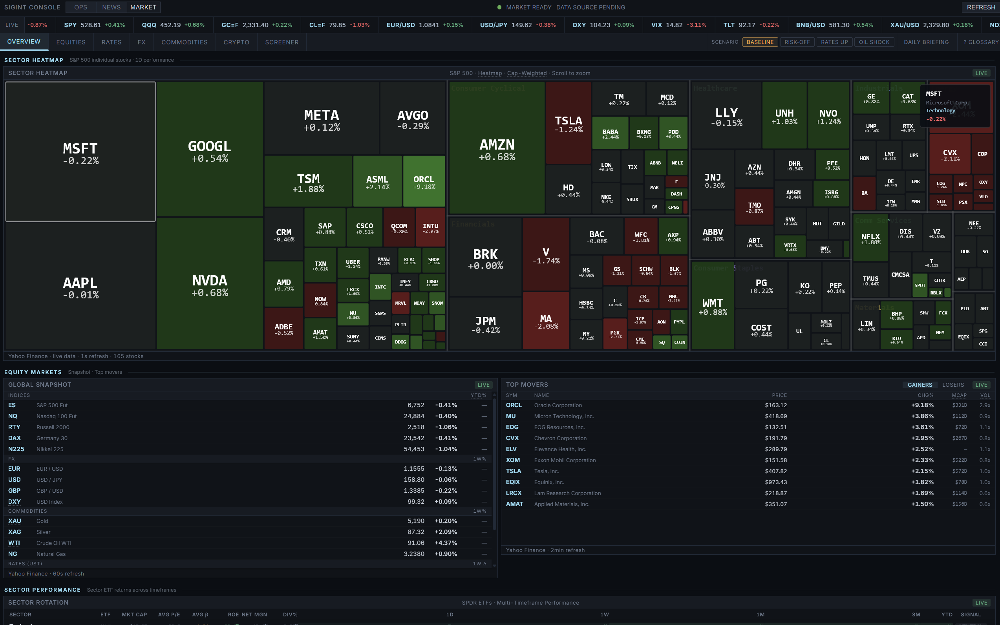
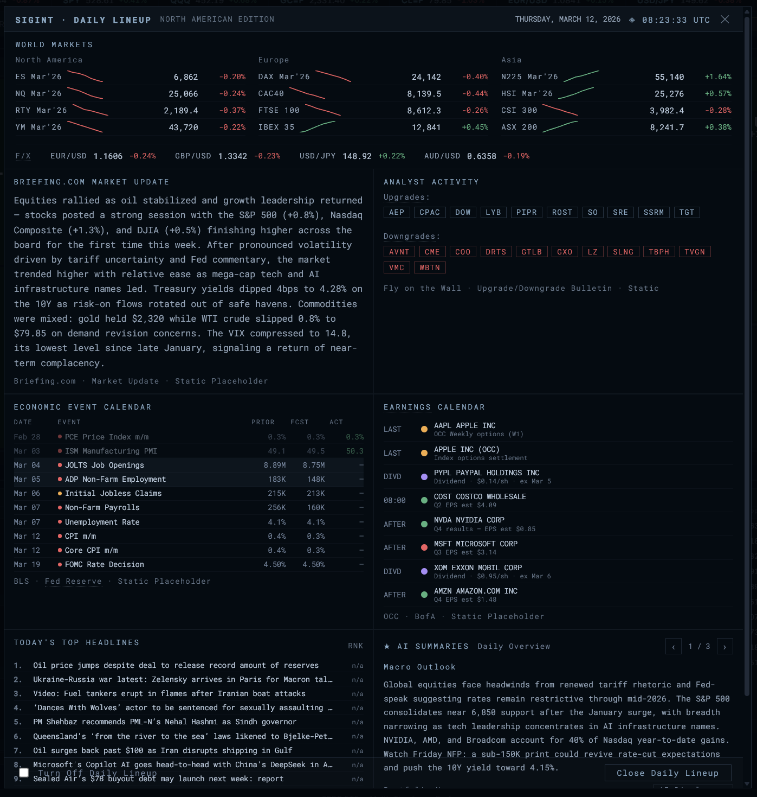

<div align="center">



# SIGINT

**Open-source geospatial intelligence platform**

Three workspaces &mdash; OPS, NEWS, MARKET &mdash; unified in a single console for monitoring global events, conflicts, markets, and live feeds in real time.

[](https://nextjs.org/)
[](https://www.typescriptlang.org/)
[](https://cesium.com/)
[](https://react.dev/)
<br/>
[](LICENSE)
[](https://github.com/Skytuhua/SIGINT/actions)
[](package.json)
[](https://github.com/Skytuhua/SIGINT/stargazers)
[](https://github.com/Skytuhua/SIGINT/commits)
[](https://github.com/Skytuhua/SIGINT/pulls)

</div>

---

## Features at a Glance

- **3 Integrated Workspaces** &mdash; OPS (3D globe), NEWS (intel feeds), MARKET (financial analytics)
- **Real-Time Tracking** &mdash; 5,900+ flights, 900 military signals, 1,520 satellites, seismic events, CCTV feeds
- **55+ API Routes** &mdash; Live data from OpenSky, GDACS, ACLED, GDELT, CoinGecko, SEC, and more
- **23+ GeoJSON Layers** &mdash; Conflict zones, sanctions, nuclear sites, undersea cables, pipelines, refugee camps
- **120+ Components** &mdash; 47 market panels across 7 tabs, draggable dashboard, multi-panel layouts
- **Visual Modes** &mdash; Normal, CRT scanline, Night Vision (NVG), Thermal (FLIR)
- **AI Summarization** &mdash; OpenAI server-side + browser-based LLM via WebLLM
- **Full-Text Search** &mdash; Boolean query parser with inverted index for instant recall
- **Sanctions Compliance** &mdash; OFAC, UN, EU, UK entity screening with profiles
- **Web Workers** &mdash; SGP4 satellite propagation + traffic simulation off main thread

> *Built with Next.js 14, React 18, TypeScript, CesiumJS, MapLibre, Zustand, and Tailwind CSS.*

---

## Workspaces

### OPS &mdash; 3D Globe & Operations


> CesiumJS-powered 3D globe with 20+ toggleable data layers and a draggable panel dashboard.

- Live commercial & military flight tracking (OpenSky / ADS-B Exchange)
- Satellite positions with SGP4 propagation via Web Workers
- Disaster alerts (GDACS) with magnitude filtering
- GPS interference / jamming zone detection
- Trade route visualization with disruption signals
- Visual presets: Normal, CRT scanline, Night Vision (NVG), Thermal (FLIR)
- Google Maps-style custom navigation (pan, orbit, zoom)

<details>
<summary><strong>Dashboard & Live Feeds</strong></summary>
<br/>



- **System Snapshot** &mdash; Real-time KPIs: tracked flights, military signals, seismic events, satellites, CCTV nodes
- **Ops Feed** &mdash; Chronological event stream with source tagging (FLIGHT, SWPC, GDACS)
- **Live Webcams** &mdash; CCTV mosaic wall with region filters and single-focus view
- Flight table, earthquake table, satellite list, space weather alerts

</details>

---

### NEWS &mdash; Intelligence & Geospatial Feeds



> Multi-source news aggregation with MapLibre map layers, 13+ category feeds, and live video grid.

- Aggregation from NewsAPI, GDELT, ACLED, HackerNews, RSS, Wikimedia stream, SEC, YouTube
- Full-text search with boolean query parser and inverted index
- 22+ GeoJSON layers: conflict zones, sanctions entities, nuclear sites, military bases, trade routes, undersea cables, pipelines, ports, volcanoes, refugee camps, AI data centers, critical minerals, arms embargoes
- Compliance panel: OFAC / UN / EU / UK sanctions with entity profiles
- Country detail profiles (World Bank indicators + Wikidata enrichment)
- Live video grid &mdash; 4 simultaneous YouTube news streams with source switching
- Prediction markets (Polymarket)
- AI article summarization (OpenAI)
- Daily briefing modal

---

### MARKET &mdash; Financial Analytics



> 47+ panels across 7 tabs covering global markets end-to-end.

| Tab | Highlights |
|-----|------------|
| **Overview** | S&P 500 heatmap, market breadth, sector rotation, top movers, volatility, market regime |
| **Equities** | Analyst ratings, earnings calendar, short interest, insider flows, IPO & dividend calendars |
| **FX** | Currency matrix, carry trade analysis, EM currencies, converter, FX heatmap |
| **Crypto** | Market overview, on-chain metrics, charts |
| **Commodities** | Board, storage levels, shipping tracker |
| **Rates** | Yield curves, Fed funds futures, central bank decisions, credit spreads, breakeven inflation |
| **Screener** | Dynamic stock screener with technical indicators |

Additional: options chain/flow, order book, correlation matrix, interactive charting, market news tape, ticker bar.

<details>
<summary><strong>Daily Lineup View</strong></summary>
<br/>



- **World Markets** &mdash; Global futures (ES, NQ, DAX, N225, HSI) with sparklines
- **FX Rates** &mdash; Major pairs (EUR/USD, GBP/USD, USD/JPY, AUD/USD)
- **Economic Calendar** &mdash; Upcoming releases with prior/forecast/actual
- **Earnings Calendar** &mdash; Next reporting companies with EPS estimates
- **AI Summaries** &mdash; Daily macro outlook generated from market data
- **Top Headlines** &mdash; Ranked news with relevance scoring

</details>

---

## Tech Stack

| Layer | Technology |
|-------|------------|
| Framework | Next.js 14.2, React 18.3, TypeScript 5.5 |
| 3D Globe | CesiumJS 1.120 |
| Maps | MapLibre GL, Leaflet |
| State | Zustand (persist + subscribeWithSelector) |
| Layout | react-grid-layout, @dnd-kit |
| Styling | Tailwind CSS 3.4 |
| Tables | TanStack React Table + React Virtual |
| Workers | satellite.js (SGP4), traffic simulation |
| Validation | Zod |
| Streaming | hls.js |
| LLM | WebLLM (browser), OpenAI (server) |
| Package Manager | pnpm |

---

## Getting Started

### Prerequisites

- Node.js 20.18.1+
- [pnpm](https://pnpm.io/)

Use `pnpm` for installs in this repo. The tracked lockfile is `pnpm-lock.yaml`.

### Quick Start

```bash
git clone https://github.com/Skytuhua/SIGINT.git
cd SIGINT
pnpm install
cp .env.example .env.local
pnpm dev
```

Open [http://localhost:3000](http://localhost:3000) in your browser.

### Environment Variables

**Required:**

| Variable | Purpose |
|----------|---------|
| `NEXT_PUBLIC_CESIUM_ION_TOKEN` | Cesium terrain & 3D tiles ([free account](https://ion.cesium.com/)) |
| `NEXT_PUBLIC_MAPTILER_KEY` | MapTiler basemaps ([free tier](https://www.maptiler.com/)) |

<details>
<summary><strong>Optional &mdash; enable full functionality</strong></summary>
<br/>

| Variable | Purpose |
|----------|---------|
| `YOUTUBE_API_KEY` | Live video feeds (falls back to RSS) |
| `OPENAI_API_KEY` | Article summarization |
| `NEWS_API_KEY` | NewsAPI articles |
| `OPENSKY_USERNAME` / `OPENSKY_PASSWORD` | Flight data |
| `ADSBX_COMMERCIAL_URL` / `ADSBX_MILITARY_URL` | Military aircraft |
| `NEXT_PUBLIC_FREE_LLM_BASE_URL` | Free LLM service |
| `INTEL_HOTSPOTS_URL` | Intel hotspot data |

See [`.env.example`](.env.example) for the full list.

</details>

### Commands

```bash
pnpm dev          # Development server
pnpm build        # Production build
pnpm start        # Start production server
pnpm test         # Run tests (vitest)
```

---

## Architecture

- **Browser-only Cesium** &mdash; all CesiumJS code loads client-side via dynamic imports, no SSR
- **Web Workers** &mdash; satellite propagation (SGP4) and traffic simulation offloaded from main thread
- **Zustand store** &mdash; single store with selective subscriptions for reactive layer rendering
- **GLSL post-processing** &mdash; custom shader stages for CRT, NVG, FLIR visual modes
- **Pluggable map renderers** &mdash; shared GeoJSON layer catalog with MapLibre and Leaflet backends
- **Preload system** &mdash; parallel bundle warmup for heavy components before first render
- **Persistent caching** &mdash; IndexedDB-backed feed cache with localStorage metadata
- **SSRF protection** &mdash; server-side URL validation for proxy endpoints

---

<details>
<summary><strong>Project Structure</strong></summary>
<br/>

```
src/
├── app/
│   ├── api/                  # 55+ API routes
│   │   ├── cctv/             # CCTV proxy & search
│   │   ├── market/           # Quotes, movers, earnings, historical, news
│   │   ├── news/             # ACLED, GDELT, sanctions, layers, RSS, search, stream
│   │   ├── earthquakes/      # Earthquake data
│   │   ├── gdacs/            # Disaster alerts
│   │   ├── military/         # Military flight tracking
│   │   ├── opensky/          # Commercial flights
│   │   ├── satellites/       # Satellite TLE data
│   │   └── space-weather/    # Solar activity
│   ├── layout.tsx
│   └── page.tsx
├── components/
│   ├── SIGINTApp.tsx         # Root shell — OPS / NEWS / MARKET routing
│   ├── CesiumGlobe.tsx       # 3D globe (browser-only, ~2000 lines)
│   ├── dashboard/            # OPS panels, charts, controls, inspector
│   ├── market/               # 47+ financial panels, 7 tabs
│   ├── news/                 # News panels, detail cards, maps, feeds
│   └── ui/                   # HUD, layer bar, panels, style presets
├── config/                   # Feature flags, CCTV, news sources, RSS, LLM
├── lib/
│   ├── cesium/               # Viewer init, layers, nav, GLSL shaders
│   ├── news/                 # Search engine, categorization, streaming
│   ├── newsLayers/           # GeoJSON layer catalog + renderers
│   ├── server/               # Server-only: providers, sanctions, CCTV
│   ├── runtime/              # Fetch wrappers, IndexedDB cache
│   ├── providers/            # Zod schemas for all data types
│   └── llm/                  # LLM integration
├── store/                    # Zustand global store
├── workers/                  # Web Workers (satellite, traffic)
└── data/                     # Static data (market glossary)

public/
├── cesium/                   # CesiumJS static assets
└── data/
    ├── news-layers/          # 22+ GeoJSON layer files
    ├── cctv_sources.json     # Curated YouTube camera feeds
    └── ne_*.geojson          # Natural Earth boundaries
```

</details>

<details>
<summary><strong>Data Sources</strong></summary>
<br/>

| Source | Data |
|--------|------|
| OpenSky Network | Commercial flight positions |
| ADS-B Exchange | Military aircraft tracking |
| GDACS | Disaster alerts |
| USGS | Earthquake data |
| GDELT | Global event data |
| ACLED | Armed conflict events |
| UCDP | Conflict zone boundaries |
| NewsAPI | News articles |
| CoinGecko | Crypto market data |
| Polymarket | Prediction markets |
| SEC EDGAR | Financial filings |
| World Bank | Economic indicators |
| OFAC / UN / EU / UK | Sanctions lists |
| Wikidata | Entity enrichment |
| YouTube / Invidious | Live video streams |
| OpenStreetMap / Overpass | Geospatial queries |
| NOAA / SWPC | Space weather |

</details>

<details>
<summary><strong>Keyboard Shortcuts</strong></summary>
<br/>

| Key | Action |
|-----|--------|
| `1` / `2` / `3` | Switch workspace (OPS / NEWS / MARKET) |
| `Ctrl+I` | Toggle inspector drawer |
| `Ctrl+Shift+R` | Refresh all feeds |
| `Ctrl+.` | Toggle hotkey overlay |
| Scroll wheel | Zoom globe / scroll panels |

</details>

---

## Contributing

Contributions are welcome! Please:

1. Fork the repository
2. Create a feature branch (`git checkout -b feat/your-feature`)
3. Commit your changes (`git commit -m 'feat: add your feature'`)
4. Push to the branch (`git push origin feat/your-feature`)
5. Open a Pull Request

---

## Star History

[](https://star-history.com/#Skytuhua/SIGINT&Date)

---

## License

MIT &mdash; see [LICENSE](LICENSE) for details.

<div align="center">
<br/>
<sub>Built with Next.js, CesiumJS, and open data. Star the repo if you find it useful.</sub>
</div>
